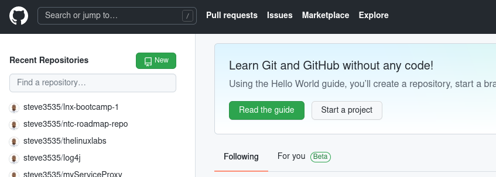
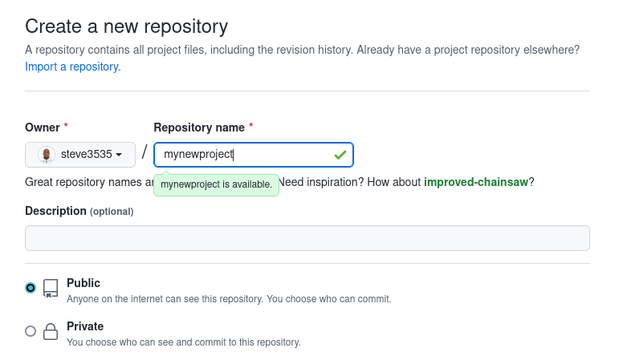
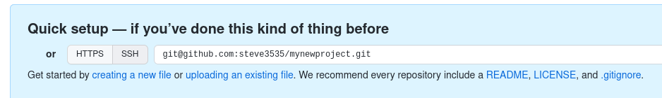
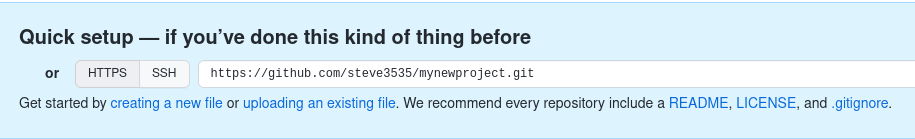
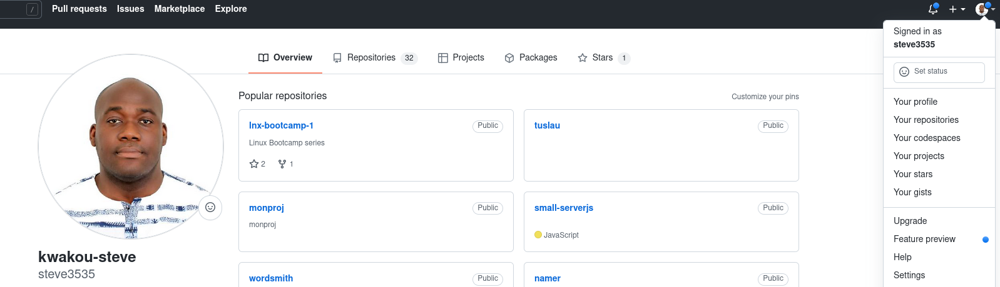
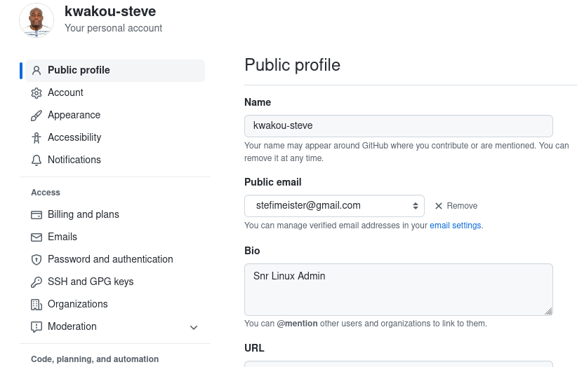
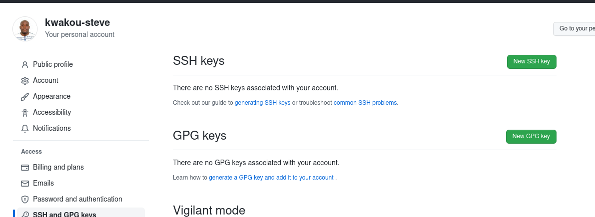
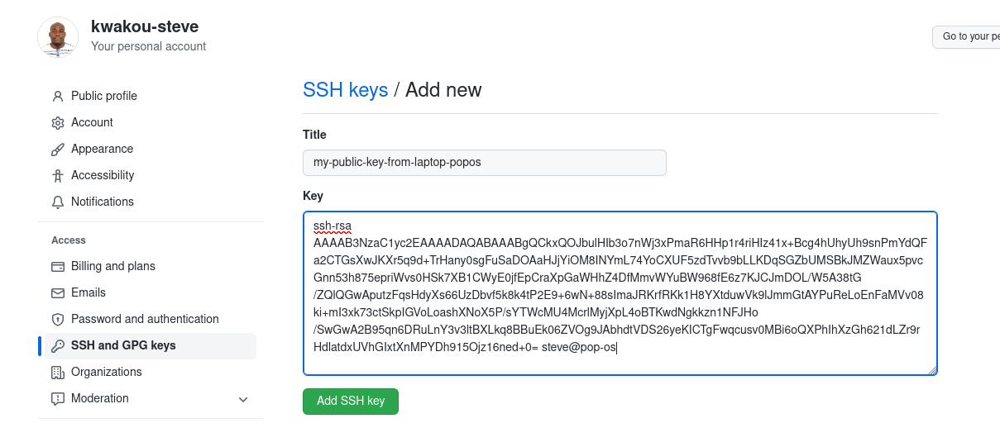

# Getting started with GitHub and GitLab

## intro

from the perspective of Git, Github, GitLab, Bickbucket, Atlassian, etc .. are just remote repositories hubs.  
The same revision or version history paradigm we learned in the previous chapter applies to them.

## Create a new project  

## Create a new repository  

  

## Clone the repo via ssh

  

`git clone git@github.com:steve3535/mynewproject.git projects/mynewproject`  

## Clone the repo via https (less performant)  

    

`git clone https://github.com/steve3535/mynewproject.git projects/mynewproject`    

> **Guided exercise: create a new repo in your account and clone it via ssh**    
>  Try and run the command to clone a new repo : `git clone git@github.com:steve3535/mynewproject.git projetcs/mynewone`   
>  *(replace steve3535 by your own username and myproject.git by your own repo name)*  
>  Unless you already have a ssh key configured with your github account, the above command will throw an error.  
>  If that's the case, lets fix it !  

1. Generate a SSH keypair that will be used for github authentication (**you can use any existing public key on your machine if you will**)  
   * `ssh-keygen -f ./my_github_keys`   
   * copy the public key (the one with .pub extension) in your clipboard    
   
2. Set the SSH public key on your account on GitHUb    

   * Go to your profile and chose settings:    
   
       
   
   * Locate SSH and GPG keys submenu:    
   
       
   
   * Click on SSH keys:  
       
   
   * Paste your public key in there:  
        
   
 3. Run the clone command once again: this time, it should work seamlessly.    

## Fork  

You can copy a project easily by forking it.  
When you fork a project, you get a cloned version of that project that is hosted on the same platform (here GitHUb)  
From the git remotes concept, your **origin** is then the fork and the original project becomes the **upstream**.  

The best practice is then to clone the fork in order to work on the project locally, and push your modifications back to the fork hosted on Github.  
Once you are done and you can ask for the integration of your modifications in the upstream by making a **Pull Request**.  

